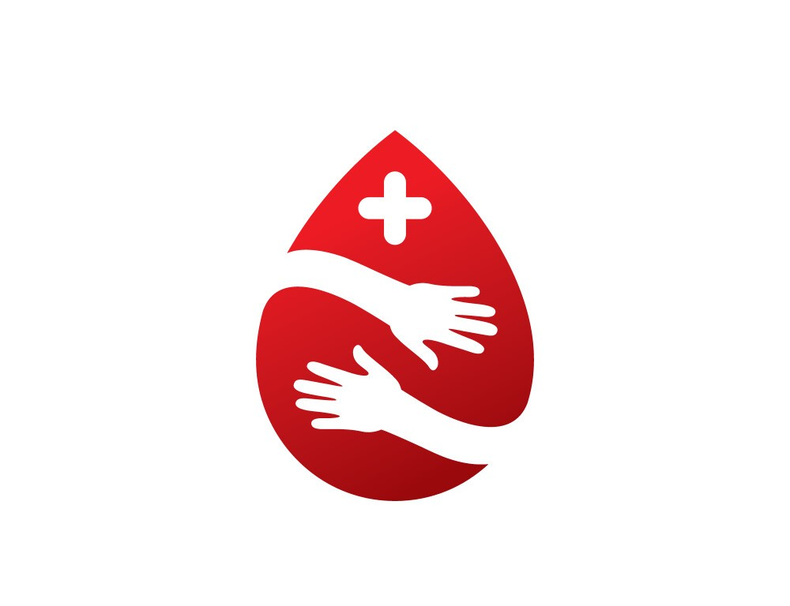

[](LICENSE)
[](https://azure.microsoft.com/en-in/products/ai-services/openai-service)
[](https://react.dev/)
[](https://tailwindcss.com/)
[](https://azure.microsoft.com/)

<div align="center">

<h1>CrimsonCare 🩸</h1>
<h2>
<a href="#-getting-started">Quickstart</a> |
<a href="#-features">Features</a> |
<a href="#-tech-stack">Tech Stack</a> |
<a href="#-roadmap">Roadmap</a> |
<a href="#-contributors">Contribute</a>
</h2>

</div>

## 🩸 Welcome to CrimsonCare

CrimsonCare is a **Smart Blood Donation & Emergency Response** platform that connects **Donors, Patients, Hospitals, and Blood Banks** in real time.  
It eliminates fake requests with **ABHA ID & prescription verification**, ensures **emergency-first prioritization**, and provides a **24/7 AI Assistant** for instant help.

---

## 🌟 Why CrimsonCare?

- **Emergency-First Design**: Glowing alerts for urgent blood requests.  
- **Verified Requests**: Secure ABHA ID and prescription upload.  
- **Central Hub**: One platform for patients, donors, hospitals & blood banks.  
- **AI Assistant**: Powered by Azure OpenAI for FAQs and guidance.  
- **Scalable Cloud Infra**: Built on Azure for performance & reliability.  

<div align="center">

</div>

---

## ✨ Features

- 🔐 **Secure Login** (User, Hospital, Blood Bank)  
- 📊 **Dashboard** (Request or Donate Blood in 1 click)  
- ⏱️ **Emergency Requests Highlighted**  
- 🤖 **AI Assistant (Azure OpenAI)**  
- 🧾 **ABHA & Prescription Verification**  
- 👩‍⚕️ **Patient & Donor Lists with Status**  
- 📍 **Future Enhancements**: Geo-location, AI stock prediction, blockchain records  

---

## 🧭 User Journey

1. **Register / Login** as Donor, Patient, Hospital, or Blood Bank.  
2. **Dashboard** → choose Request or Donate.  
3. **Patients** upload ABHA ID + doctor’s prescription.  
4. **System** matches donors & patients.  
5. **Emergency Requests** always visible with glowing “Donate” button.  
6. **Hospitals & donors** coordinate seamlessly.  

---

## 🛠️ Tech Stack

- **Frontend:** React + TailwindCSS  
- **Backend (planned):** Node.js/Express or Python (FastAPI/Django)  
- **Database (planned):** Azure SQL with ABHA ID integration  
- **AI Assistant:** Azure OpenAI  
- **Hosting:** Azure Cloud  

---

## 🚀 Getting Started

```bash
# Clone repo
git clone https://github.com/<your-username>/crimsoncare.git
cd crimsoncare

# Run locally (just open index.html) or use a dev server
npx serve .
